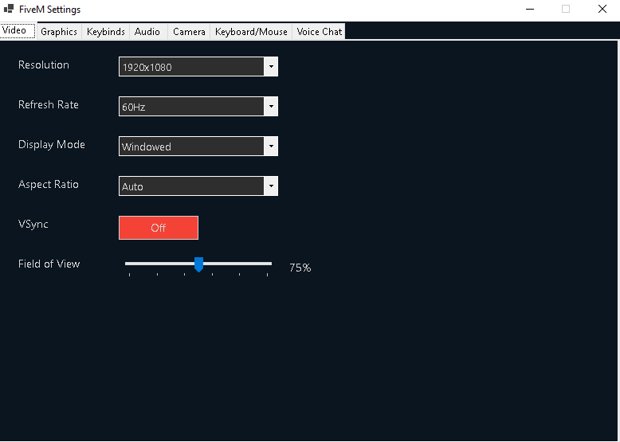

## Clean Connect Launcher

🚀 En moderne og brukervennlig Windows-lanserer designet for alle FiveM-servere. Lanseren gir spillere rask tilgang, vedlikehold, feilsøking og automatiske klientoppdateringer, kompatibel med enhver FiveM-server uavhengig av rollespillfellesskap eller konfigurasjon.

# 🧩 Funksjoner

✅ Sletting av FiveM-cache og krasjrapporter (deaktivert som standard, kan aktiveres via innstillinger)

✅ Visning av serverstatus (FiveM/Cfx-plattformen)

✅ Enkelt grafisk brukergrensesnitt bygget med Windows Forms

✅ Automatisk visning av ping og latenstid for valgt server

✅ Støtte for flere servere for brukere som spiller på mer enn én FiveM-server

✅ F3-knapp for å bytte server når flere servere er lagt til

✅ Installasjon/ominstallasjon av Microsoft Visual C++ Redistributable

## 🎮 GTA 5/FiveM-innstillinger: Grafikk, talechat-innstillinger osv. før tilkobling til spillet

✅ Programmet lar deg enkelt konfigurere grafikk- og lydinnstillinger for FiveM/GTA V direkte fra lanseringsprogrammet:

## PS: Alle FiveM-innstillinger oppdateres automatisk så snart en endring er gjort.

🖼️  <!-- Legg til ekte bilde hvis mulig -->

### For Strømmere
- Stabil ytelse under strømming ✅
- God bildekvalitet for seere ✅
- Balansert ressursbruk ✅
- Anbefalte innstillinger:
  - Deaktiver dybdeskarphet (DoF) for bedre lesbarhet ✅
  - Bruk FXAA i stedet for TXAA for mindre "ghosting" ✅

# 📥 Nedlasting
Finn den nyeste versjonen her: 👉 GitHub Releases
Installasjonsfil: CleanConnectLauncher_setup.exe

# 📦 Installasjon
✅ Støtte for flere språk (🇳🇴 Norsk / 🇬🇧 Engelsk)

✅ Automatiske og manuelle oppdateringssjekker via GitHub Releases

✅ Valgfritt førstegangsoppsett (velg server, port, språk og FiveM-innstillinger)

Last ned .exe-filen fra releases-siden
Kjør installasjonsfilen, som automatisk installerer .NET 8 hvis det ikke allerede finnes på systemet
Ved første oppstart blir du bedt om å velge server og språk
Lanseren starter serveren automatisk etter oppsettet

# ⚙️ Teknologi

.NET Framework / .NET 8 - Windows Forms (WinForms) - C# - GitHub API for versjonssjekk

# 🔁 Oppdateringer
Ved oppstart sjekker lanseren automatisk for nye versjoner. Du kan også manuelt klikke "Sjekk for oppdateringer" i innstillingene.
Oppdateringer hentes direkte fra denne GitHub-siden, og installasjonsprogrammet starter automatisk.

# 🗃️ Mappestruktur og cache-opprydding
Følgende mapper kan ryddes via lanseren:

FiveM\FiveM.app\data\server-cache-priv

FiveM\FiveM.app\data\game-storage

FiveM\FiveM.app\data\nui-storage (designet for å bevare innloggingsdata, slik at du ikke trenger å autentisere på nytt med Cfx-kontoen din i FiveM etter opprydding)

FiveM\FiveM.app\data\server-cache

FiveM\FiveM.app\crashes

FiveM\FiveM.app\data\cache

GTA5-innstillingsfil (gta5_settings.xml)

# 🛠️ Feilsøking

Forslag til feilsøking:

Sørg for at FiveM er riktig installert.

Bruk lanserens innstillinger for å slette cache, krasjrapporter og andre FiveM-filer.

Hvis problemet vedvarer, start PC-en på nytt og prøv igjen.

Installer FiveM på nytt med brukerbackup (hvis du var logget inn med en Cfx-konto, kreves ingen ny autentisering, da lanseren sørger for at dataene dine gjenopprettes korrekt etter ominstallasjon).

Installer / Ominstaller FiveM:

Status: Klar til å installere

# 🛠️ Planlagte forbedringer

🛠️ Forslag til forbedringer er velkomne! Del ideene dine via et problem (issue).

# 💬 Kontakt og bidrag
Dette er et åpen kildekode-prosjekt. Har du forslag eller forbedringer?

Opprett et problem (issue)
Eller send inn en pull request

Hvis du ønsker støtte for flere språk, vennligst kontakt meg via et problem og spesifiser hvilket språk du ønsker å se lagt til.

# 📸 Skjermbilder
Nedenfor er noen skjermbilder av Clean Connect Launcher i aksjon:

© 2025 – Utviklet med ❤️ for FiveM-fellesskapet av Nightbox RP.
